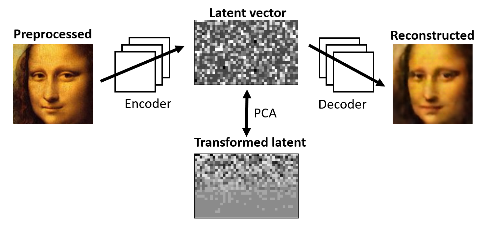
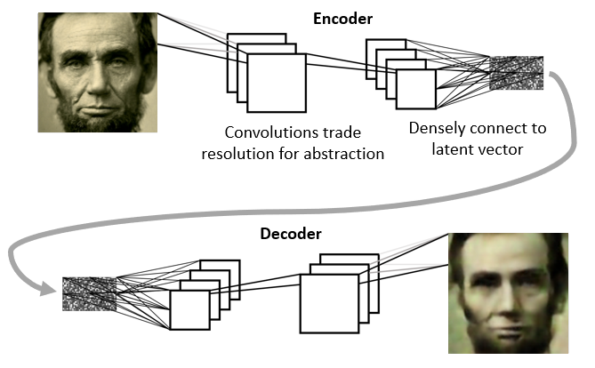
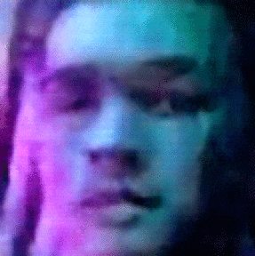
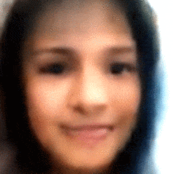

# Deep Face Morph

Compares significant features in faces with a convolutional autoencoder and principal component analysis (PCA).

## Getting started

Install with `requirements.txt` (recommended) or the following commands in an Anaconda environment:

```
conda install python=3.7
conda install numpy
conda install tensorflow
conda install pillow
conda install bs4
pip install opencv-python
```

To download and preprocess the training data (from an archive.org capture of famousbirthdays.com), run `scraper.py` then `preprocessor.py`.

Train the model and run the main application with `deep_face_morph.py`.

## Model Overview

A convolutional autoencoder is trained on the images, then PCA is performed on their latent space representations.



## Convolutional Autoencoder

The encoder and decoder models are trained together, using the input images as labels.

This incentivizes the autoencoder to find a low-dimensional encoding from which it can reconstruct the original images as accurately as possible.



## Principal Component Analysis

Applying PCA to the latent vectors identifies a new set of meaningful features.

Below shows the manipulation of the feature with the fourth-highest eigenvalue, which seems to control lighting from the side. The picture was taken in a room with purple lighting, which it accounts for realistically.



Below is the feature with the seventh-highest eigenvalue, seemingly corresponding to horizontal rotation. Recall that these features were all "discovered" by the model.



Comparing these features can be used to find lookalikes: as they are extracted from images of faces, many should correspond to facial structure.

In the future, lookalikes can be improved by weighting features based on how consistent they are between photographs of the same person.
